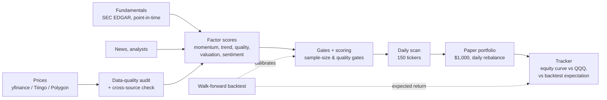

# Signal or Noise? A forward test of a multi-factor stock model

[](https://github.com/miemielove520/signal-or-noise/actions/workflows/tests.yml)

A research framework for US equities. It scores a 150-stock universe on technical, fundamental, valuation, and sentiment factors, and validates the rules with walk-forward backtests. Since July 2026 it has also run an **untouched paper portfolio in real time**, so the model can be judged on data it has never seen.

The main question is statistical, not financial:

> **When a model looks good in a backtest, how much of that survives contact with the real market, and how can you tell skill from noise?**

> Research and education only. Not investment advice.

---

## Early result: the model is losing to the benchmark

The paper portfolio started with $1,000 on 2026-07-09 and is rebalanced automatically every trading day. The rules are frozen; see [policy freeze](#experimental-protocol).

| As of 2026-09-24 (52 trading days) | Value |
|---|---|
| Model paper portfolio | **−24.7 %** |
| Benchmark (QQQ) | **+2.5 %** |
| Max drawdown | −29.4 % |
| Walk-forward backtest expectation (annualized) | +26 % |

This is the most interesting part of the project. The walk-forward backtest expected about +26 % a year, and the tracker's built-in gate now flags the paper run as **divergent** (likely overfit). The analysis below asks why the forward result is so different and whether the gap is statistically meaningful.

<!-- TODO (Oct): replace with equity-curve chart + bootstrap CI on excess return -->

## Experimental protocol

- **No lookahead.** Fundamentals are joined only when `report_date <= signal_date`. Point-in-time SEC filing history is used where available.
- **Walk-forward validation.** Thresholds are calibrated on past windows and tested on the following window, never on the same data.
- **Minimum sample gates.** A calibrated rule is adopted only with ≥ 30 out-of-sample trades (`walk_forward.MIN_CALIBRATION_SAMPLE_COUNT`). An overfitting-risk report tracks the ratio of samples to tunable parameters for each rule profile.
- **Policy freeze.** Changing the model mid-experiment would mix two strategies into one equity curve. The strategy is therefore versioned and frozen, and every change is logged in [`docs/POLICY_LOG.md`](docs/POLICY_LOG.md). v1 was discarded after 2 days for exactly this reason.
- **Realistic fills.** Paper buys fill above the close and sells below it (a 10 bps spread), so trading costs are real.

## Statistical analysis (in progress)

| Question | Method | Status |
|---|---|---|
| Is the underperformance distinguishable from luck? | Block-bootstrap CI on daily excess return vs QQQ | planned (Oct) |
| Are the model's win probabilities honest? | Reliability diagram, Brier score | planned (Oct) |
| How much did the backtest overfit? | In-sample vs out-of-sample gap, multiple-testing adjustment | planned (Oct) |
| Does survivorship bias inflate the backtest? | Point-in-time index membership | mechanism built, data pending |

## How it works



| Module | Role |
|---|---|
| `data.py`, `real_data.py`, `sec_data.py` | Pluggable price providers, SEC companyfacts, caching |
| `audit.py` | Price-data quality checks (gaps, stale prices, bad OHLC) |
| `factors.py`, `fundamentals.py`, `valuation.py`, `sentiment.py` | Factor construction |
| `analysis.py`, `scanner.py` | Scoring, gates, entry/exit plans |
| `walk_forward.py` | Walk-forward validation, calibration, overfitting report |
| `paper.py`, `paper_tracker.py`, `paper_audit.py` | Paper trading, equity tracking, readiness verdicts |
| `historical_universe.py` | Point-in-time universe membership (survivorship bias) |

About 34k lines of Python and 358 unit tests.

## Quick start

```bash
python3 -m venv .venv
.venv/bin/pip install -e ".[ml]"

# Offline demo on bundled synthetic data (no network, no API keys)
.venv/bin/stock-selector run --config configs/default.toml

# Analyze one real ticker (downloads data)
.venv/bin/python run.py AAPL

# Run the test suite
.venv/bin/python -m unittest discover -s tests
```

The synthetic demo only checks that the pipeline runs. Its metrics mean nothing.

To track your own holdings, copy `portfolio.example.csv` → `portfolio.csv` and `watchlist.example.txt` → `watchlist.txt`. Both are git-ignored. Full CLI reference: [`docs/USAGE.md`](docs/USAGE.md).

## Known limitations

- **Survivorship bias.** The backtest universe is today's list of stocks, so companies that failed or were delisted are missing. That makes the backtest look better than it should.
- **Fundamentals are partly restated.** yfinance fundamentals are not point-in-time. SEC data is used where possible.
- **Small forward sample.** A few months of daily returns cannot confirm or reject a strategy with confidence. The analysis reports uncertainty instead of a verdict.
- **Free data only.** The "money flow" indicators are price/volume proxies, not institutional flow data.

## About this project

<!-- TODO (you): 3–5 sentences in your own voice. Why you started this, what you learned, what surprised you. -->

This project was built with the help of AI coding assistants (Claude Code).
<!-- TODO (you): describe what you designed and decided (research question, protocol, freeze rule, interpretation) vs. what the assistant implemented. -->

## License

[MIT](LICENSE)
