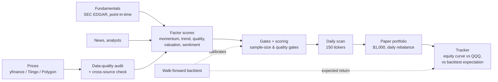

# Signal or Noise? A forward test of a multi-factor stock model

[](https://github.com/miemielove520/signal-or-noise/actions/workflows/tests.yml)

A research framework for US equities. It scores a 150-stock universe on technical, fundamental, valuation, and sentiment factors, and validates the rules with walk-forward backtests. Since July 2026 it has also run an **untouched paper portfolio in real time**, so the model can be judged on data it has never seen.

The main question is statistical, not financial:

> **When a model looks good in a backtest, how much of that survives contact with the real market, and how can you tell skill from noise?**

> Research and education only. Not investment advice.

---

## Result: the backtest did not survive the forward test

| | Return |
|---|---|
| Walk-forward backtest, top picks (2025-03 → 2026-04) | **+99 %** (QQQ +37 %) |
| Frozen forward test, $1,000 paper portfolio (2026-07-09 → 09-24) | **−24.7 %** |
| QQQ over the same 51 days | +2.6 % |
| The model's own 149-stock universe, equal weight | +3.8 % |


**📄 Full write-up: [results/REPORT.md](results/REPORT.md)**

Main findings:

1. **The loss is real, not noise.** A block-bootstrap 95 % CI for daily excess return vs QQQ is [−0.89 %, −0.33 %].
2. **The backtest's own distribution makes this outcome unlikely.** Only 2.8 % of 51-day windows re-sampled from the backtest are this bad.
3. **The live system traded a different strategy.** The backtest held picks for 20 days. The paper engine's median hold was 3 days: 115 orders and 15× turnover in 11 weeks.
4. **The score barely ranks stocks.** Mean rank IC is about 0.05 (p > 0.1). A "significant" top-5 edge appears for only 1 of 3 scoring profiles, and it fails a Bonferroni correction for the number of configurations tried.
5. **The win probabilities are overconfident.** The Brier skill score is −0.16 (short profile; −0.27 and −0.28 for the others), which is worse than always predicting the 52 % base rate.
6. **The sample sizes were inflated.** Every outcome was counted 3 times (6,219 "signals" → 2,058 distinct → 14 independent dates).

<p>


</p>

## Experimental protocol (v2)

- **No lookahead.** Fundamentals are joined only when `report_date <= signal_date`. Point-in-time SEC filing history is used where available.
- **Walk-forward validation.** Thresholds are calibrated on past windows and tested on the following window, never on the same data.
- **Minimum sample gates.** A calibrated rule is adopted only with ≥ 30 out-of-sample trades (`walk_forward.MIN_CALIBRATION_SAMPLE_COUNT`). An overfitting-risk report tracks the ratio of samples to tunable parameters for each rule profile. *The post-mortem found that these counts pool three scorings of the same outcome; see the report, section 6.*
- **Policy freeze.** Changing the model mid-experiment would mix two strategies into one equity curve. The strategy is therefore versioned and frozen, and every change is logged in [`docs/POLICY_LOG.md`](docs/POLICY_LOG.md). v1 was discarded after 2 days for exactly this reason.
- **Realistic fills.** Paper buys fill above the close and sells below it (a 10 bps spread), so trading costs are real.

## How it works



| Module | Role |
|---|---|
| `data.py`, `real_data.py`, `sec_data.py` | Pluggable price providers, SEC companyfacts, caching |
| `audit.py` | Price-data quality checks (gaps, stale prices, bad OHLC) |
| `factors.py`, `fundamentals.py`, `valuation.py`, `sentiment.py` | Factor construction |
| `analysis.py`, `scanner.py` | Scoring, gates, entry/exit plans |
| `walk_forward.py` | Walk-forward validation, calibration, overfitting report |
| `paper.py`, `paper_tracker.py`, `paper_audit.py` | Paper trading, equity tracking, readiness verdicts |
| `historical_universe.py` | Point-in-time universe membership (survivorship bias) |
| `stats_tests.py` | Stationary bootstrap, rank IC, Brier skill, reliability, multiple-testing thresholds |
| `research/forward_test.py` | The post-mortem: every number and figure in the report |

About 35k lines of Python and 345 unit tests.

## Quick start

```bash
python3 -m venv .venv
.venv/bin/pip install -e ".[ml]"

# Offline demo on bundled synthetic data (no network, no API keys)
.venv/bin/stock-selector run --config configs/default.toml

# Analyze one real ticker (downloads data)
.venv/bin/python run.py AAPL

# Reproduce the statistical post-mortem (reads results/data/ only)
.venv/bin/pip install -e ".[research]"
.venv/bin/python research/forward_test.py

# Run the test suite
.venv/bin/python -m unittest discover -s tests
```

The synthetic demo only checks that the pipeline runs. Its metrics mean nothing.

To track your own holdings, copy `portfolio.example.csv` → `portfolio.csv` and `watchlist.example.txt` → `watchlist.txt`. Both are git-ignored. Full CLI reference: [`docs/USAGE.md`](docs/USAGE.md).

## Known limitations

- **Survivorship bias.** The backtest universe is today's list of stocks, so companies that failed or were delisted are missing. That makes the backtest look better than it should.
- **Fundamentals are partly restated.** yfinance fundamentals are not point-in-time. SEC data is used where possible.
- **Small samples.** The backtest has only 14 independent signal dates, and the forward test 51 trading days. The analysis reports intervals and p-values instead of verdicts.
- **Free data only.** The "money flow" indicators are price/volume proxies, not institutional flow data.

## About this project

<!-- TODO (you): 3–5 sentences in your own voice. Why you started this, what you learned, what surprised you. -->

This project was built with the help of AI coding assistants (Claude Code).
<!-- TODO (you): describe what you designed and decided (research question, protocol, freeze rule, interpretation) vs. what the assistant implemented. -->

## License

[MIT](LICENSE)
