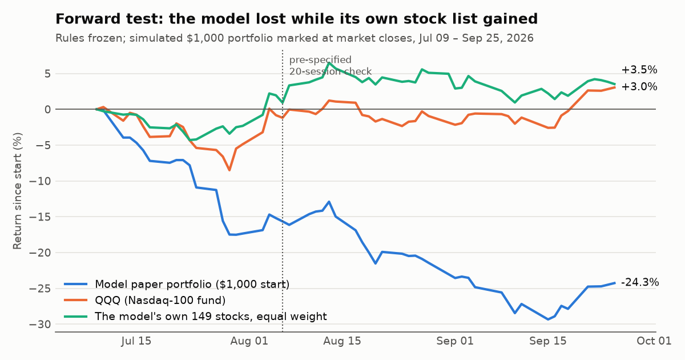
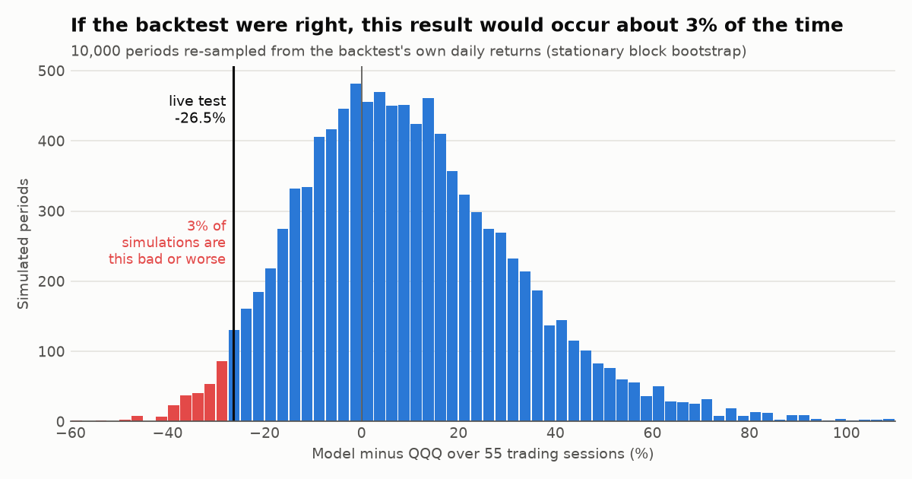
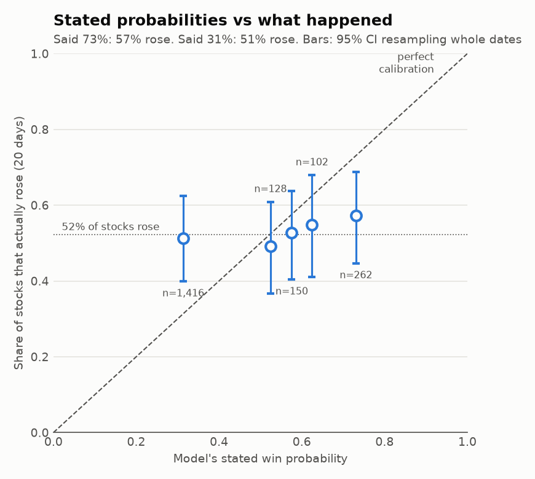
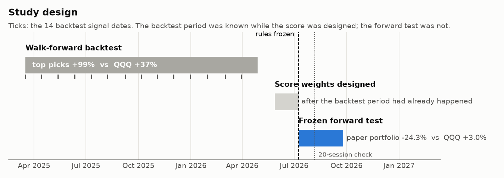
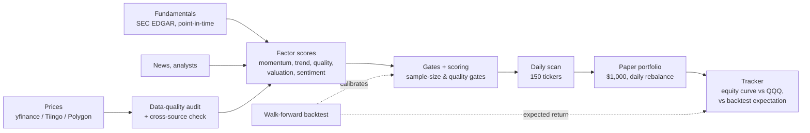

# Signal or Noise?

**A stock-picking model gained 99 % in a backtest. Frozen and run live for 11 weeks, it lost 24 %. This repository is the statistical investigation of why.**

[](https://github.com/miemielove520/signal-or-noise/actions/workflows/tests.yml)
[](https://github.com/miemielove520/signal-or-noise/releases)
[](pyproject.toml)
[](https://github.com/astral-sh/ruff)
[](LICENSE)



I built a model that scores about 150 US stocks every day on price trends, company financials, valuation, and analyst and news sentiment. On historical data (a walk-forward backtest, Mar 2025 – Apr 2026), its top picks returned **+99 %**, against **+37 %** for QQQ, a fund that tracks the Nasdaq-100. I then froze the rules and let the model run a simulated $1,000 portfolio in real time, from 9 Jul to 25 Sep 2026. It lost **24.3 %**, while QQQ gained **3.0 %** and the model's own stock list, bought in equal amounts, gained **3.5 %**.

The post-mortem finds **no evidence that the model had real skill**. It also shows where the backtest's evidence was overstated, and that the live system traded a different rule from the one that was tested.

> **Research question:** when a model looks good in a backtest, how much of that survives contact with the real market, and how can you tell skill from noise?
>
> Research and education only, not investment advice. Built with AI coding assistance; see [About this project](#about-this-project).

**📄 Read the full report:** [results/REPORT.md](results/REPORT.md) · [PDF](results/REPORT.pdf)

## At a glance

| | Backtest<br><sub>past data, Mar 2025 – Apr 2026</sub> | Live paper test<br><sub>rules frozen, 9 Jul – 25 Sep 2026 (55 sessions)</sub> |
|---|---:|---:|
| Model's top picks | **+99 %** | **−24.3 %** |
| QQQ (Nasdaq-100 fund) | +37 % | +3.0 % |
| Model's own stock list, equal weight | — | +3.5 % |

<sub>The two periods differ in length (about 13½ months vs 11 weeks). The backtest had four portfolio variants, and all of them beat QQQ (+14 % to +99 %); the headline uses the one closest to the live rules. Numbers as of the 2026-09-25 close, read from [`results/summary.json`](results/summary.json).</sub>

## What the statistics say

| Question | Answer | Method |
|---|---|---|
| Is the loss just day-to-day noise? | **No.** The model trailed QQQ by 0.60 % per daily mark; 95 % CI −0.90 % to −0.31 %. | Stationary block bootstrap |
| If the backtest were right, how often would 11 weeks look this bad? | **About 3 %** of the time. | Block bootstrap of the backtest's own returns |
| Did the live system trade what was tested? | **No.** Median hold 3 days instead of 20 sessions; 118 orders; 15.7× turnover. | Order-log audit and counterfactual |
| Does a higher score predict a higher return? | **Not detectably.** Mean rank correlation +0.05 (95 % CI −0.05 to +0.16) from only 14 dates. | Spearman rank IC per date |
| Are the model's "win probabilities" honest? | **No.** When it said 73 %, 57 % of stocks rose. That is worse than always guessing 52 %. | Brier skill score, reliability diagram |
| How much evidence did the backtest really have? | **Little.** 6,219 "signals" = 2,073 distinct outcomes on 14 dates, worth about 67 independent observations. | Pseudo-replication and design-effect audit |

**Methods used:** stationary block bootstrap · Newey–West standard errors · Spearman rank IC · sign and Wilcoxon tests · Bonferroni multiple-testing thresholds · Brier score, Murphy decomposition and reliability diagrams · Wilson and date-cluster bootstrap intervals · intraclass correlation and design effect · power analysis · walk-forward validation · point-in-time data joins.

<p>


</p>

<details>
<summary><b>New to finance? Six terms in 30 seconds</b></summary>

- **Backtest:** running the rules on past prices as if you had traded then.
- **Walk-forward:** tune on one period, test on the next, and repeat, so that the test data are never used for tuning.
- **Paper portfolio:** simulated trades at real market prices, with no real money.
- **QQQ:** a fund tracking the Nasdaq-100 index, used here as the benchmark.
- **Excess return:** the model's return minus the benchmark's.
- **Bootstrap:** resampling the data many times to see how much a result could vary by chance.
</details>

## Study design



- **No look-ahead in the data pipeline.** At each historical date the model sees prices up to that date only, and fundamentals are joined only when their `report_date` is on or before it. The score weights, however, were designed in 2026 by someone who had already seen 2025 prices; the report treats this as a threat to validity.
- **Walk-forward validation.** Thresholds (not score weights) are calibrated on past windows and tested on the following window.
- **Frozen policy.** The strategy rules were frozen on 2026-07-09. Bug and operations fixes were allowed and logged in [`docs/POLICY_LOG.md`](docs/POLICY_LOG.md). A post-hoc audit found three ways the live run differed from the written policy; they are disclosed in report §3.3. The test closed at the 2026-09-25 close, when the automated runs began to fail.
- **Modelled costs.** Paper fills are the close ± 10 bps plus about 5 bps of slippage, about 15 bps per order in total, or 2.35 % of capital over the test. The backtest portfolio is charged 10 bps per unit of turnover.

## Reproduce the results

About one minute, no network needed:

```bash
git clone https://github.com/miemielove520/signal-or-noise && cd signal-or-noise
python3 -m venv .venv && source .venv/bin/activate      # Windows: .venv\Scripts\activate
pip install -e ".[research]"
python research/forward_test.py                         # rewrites results/summary.json and results/figures/
git diff --exit-code results/summary.json && echo "numbers reproduced"
```

CI re-runs this on every push and fails if any reported number changes.

<details>
<summary><b>Explore the pipeline</b></summary>

```bash
pip install -e ".[ml,research,dev]"
stock-selector run --config configs/default.toml        # offline demo on bundled synthetic data
python run.py AAPL                                      # full single-ticker analysis (downloads data)
python -m unittest discover -s tests                    # test suite
```

The synthetic demo only checks that the pipeline runs; its metrics mean nothing. To analyse your own holdings, copy `portfolio.example.csv` → `portfolio.csv` and `watchlist.example.txt` → `watchlist.txt` (both git-ignored). The full CLI guide is in [`docs/USAGE.md`](docs/USAGE.md).
</details>

## Engineering

- Tests run in CI on Python 3.11 and 3.13: unit, command-line and offline end-to-end tests, with network calls stubbed where needed, at about 86 % line coverage (printed in every CI run).
- A test checks that every number quoted in this README and in the report matches `results/summary.json`.
- `ruff` lint and format checks.
- Every module and public function has a docstring, enforced by `tests/test_docstrings.py`.
- The statistical post-mortem is re-run in CI on every push.
- The large modules were refactored with output-equivalence checks against the previous version on real data.

<details>
<summary><b>Architecture and modules</b></summary>


```mermaid
flowchart LR
    A[Prices<br/>yfinance / Tiingo / Polygon] --> D[Data-quality audit<br/>+ cross-source check]
    B[Fundamentals<br/>SEC EDGAR, point-in-time] --> F
    C[News, analysts] --> F
    D --> F[Factor scores<br/>momentum, trend, quality,<br/>valuation, sentiment]
    F --> G[Gates + scoring<br/>sample-size & quality gates]
    G --> H[Daily scan<br/>150 tickers]
    H --> I[Paper portfolio<br/>$1,000, daily rebalance]
    I --> J[Tracker<br/>equity curve vs QQQ,<br/>vs backtest expectation]
    W[Walk-forward backtest] -. calibrates .-> G
    W -. expected return .-> J
```

| Module (`src/stock_selector/`) | Role |
|---|---|
| `data.py`, `real_data.py`, `sec_data.py` | Pluggable price providers, SEC companyfacts, caching |
| `audit.py` | Price-data quality checks (gaps, stale prices, bad OHLC) |
| `factors.py`, `fundamentals.py`, `valuation.py`, `sentiment.py` | Factor construction |
| `analysis/` | Per-ticker analysis: `horizons`, `indicators`, `backtest` (entry backtests), `signals` (scores, actions, entry plans), `screening` (quality gates, calibration), `summaries`, `render` |
| `scanner.py` | Runs the analysis across the universe and ranks candidates |
| `console_report.py` | Terminal summary of one ticker's analysis (shared by `run.py` and `stock-selector real`) |
| `walk_forward/` | Walk-forward validation: `events` (replay signals), `summaries`, `portfolio` (top-N replays vs benchmark), `policy` (tightening, sensitivity, sample guard), `calibration` (thresholds, overfitting report), `report` |
| `paper.py`, `paper_tracker.py`, `paper_audit.py` | Paper trading, equity tracking and run-date → price-date alignment, audit trail |
| `historical_universe.py` | Point-in-time universe membership (survivorship bias) |
| `stats_tests.py` | Bootstrap (stationary and clustered), Newey–West, rank IC, Brier skill and decomposition, power |

The Python package keeps the project's working name, `stock_selector`.
</details>

## Repository layout

```text
src/stock_selector/   the library: data, factors, analysis/, walk_forward/, paper trading, stats_tests.py
tests/                unit, CLI and end-to-end tests
research/             forward_test.py — regenerates every number and figure in the report
results/              REPORT.md (+ PDF), summary.json, figures/, and the exported data/ behind them
scripts/              data export, report PDF, social-preview card, sample-data generator
configs/              screening rules per sector profile, backtest defaults
universes/            ticker lists: candidates (150), market benchmarks, sector ETFs
automation/           daily pipeline script and a macOS launchd template
docs/                 USAGE.md (CLI guide), POLICY_LOG.md (frozen-policy log), ROADMAP.md (original plan)
*.py (root)           command-line scripts used by the daily pipeline; several mirror `stock-selector <subcommand>`
```

## Known limitations

- **Survivorship bias.** The backtest universe is a list made in 2026, so companies that failed or were delisted before then are missing. This flatters the backtest by an amount that cannot be estimated from these data.
- **Researcher look-ahead.** The score weights were designed after the backtest period had happened.
- **Small samples.** The backtest has 14 non-overlapping signal dates, and the forward test 55 sessions. A forward test this short can expose a failure, but it cannot confirm skill; see the power analysis in the report.
- **Partly restated fundamentals.** yfinance fundamentals are not point-in-time, so SEC filings are used where possible.
- **Free data only.** The "money flow" indicators are price and volume proxies, not institutional flow data.

## Project timeline

| When | Milestone |
|---|---|
| **May 2026** | Research framework: price loading, data-quality audit, factor scores, backtest and paper-trading engine on sample data |
| **June 2026** | Real-data single-ticker analysis. Walk-forward validation (from Jun 15), sector rule profiles, strict quality gates (Jun 22–24), backtest trust, regime coverage and decay checks (Jun 25–27), probability calibration (Jun 27), portfolio-vs-benchmark replays, sensitivity grids and a minimum-sample guard (Jun 29) |
| **July 2026** | Daily automated pipeline and dashboard. Policy v1 discarded after 2 days because the rules changed mid-test. **Policy v2 frozen and forward test started on Jul 9** |
| **Jul 9 – Sep 25, 2026** | Frozen-policy forward test: 55 trading sessions, bug and operations fixes only, each logged |
| **Sep 26, 2026** | Forward test closed at the Sep 25 close; later automated runs failed because the machine slept, and they were not re-run |
| **Sep – Oct 2026** | Statistical post-mortem ([report](results/REPORT.md)), public release, and refactoring of the largest modules with output-equivalence checks |

Development happened in a private repository. The public git history starts at the September 2026 release, because the earlier history contained my personal portfolio data. The dates above come from the project's file timestamps and [`docs/POLICY_LOG.md`](docs/POLICY_LOG.md).

## About this project

<!-- TODO (you): 3–5 sentences in your own voice. Why you started this, what you learned, what surprised you. -->

This project was built with the help of AI coding assistants (Claude Code).
<!-- TODO (you): describe what you designed and decided (research question, protocol, freeze rule, interpretation) vs. what the assistant implemented. -->

## Citation and license

GitHub's **"Cite this repository"** button uses [`CITATION.cff`](CITATION.cff). The code is released under the [MIT License](LICENSE). The market prices in `results/data/` come from Yahoo Finance via yfinance; they are third-party data and are not covered by this license.
