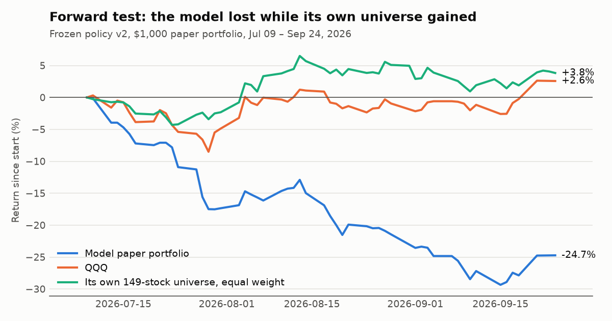
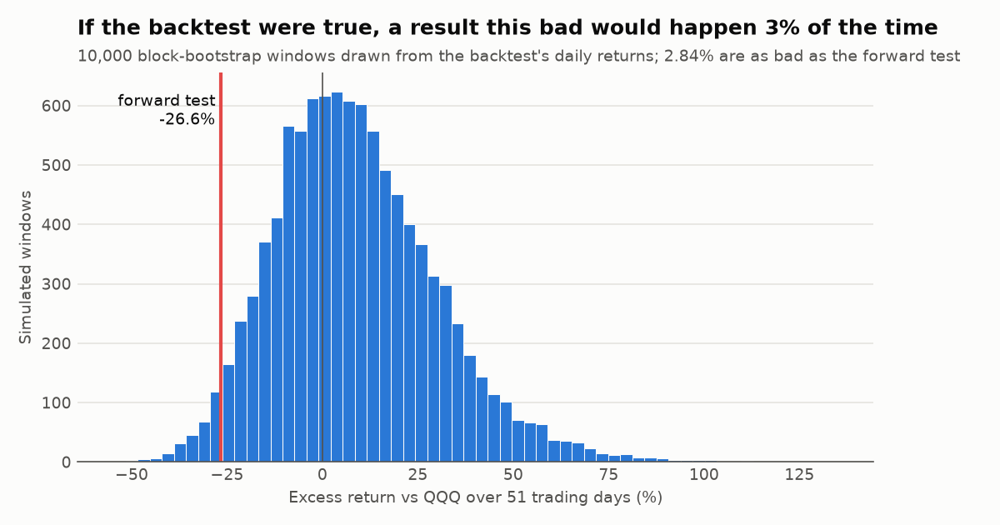
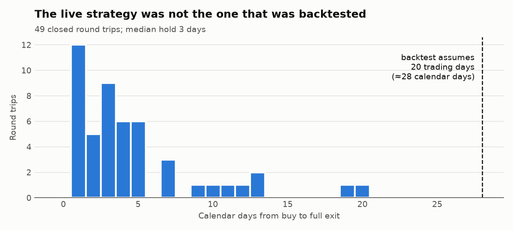
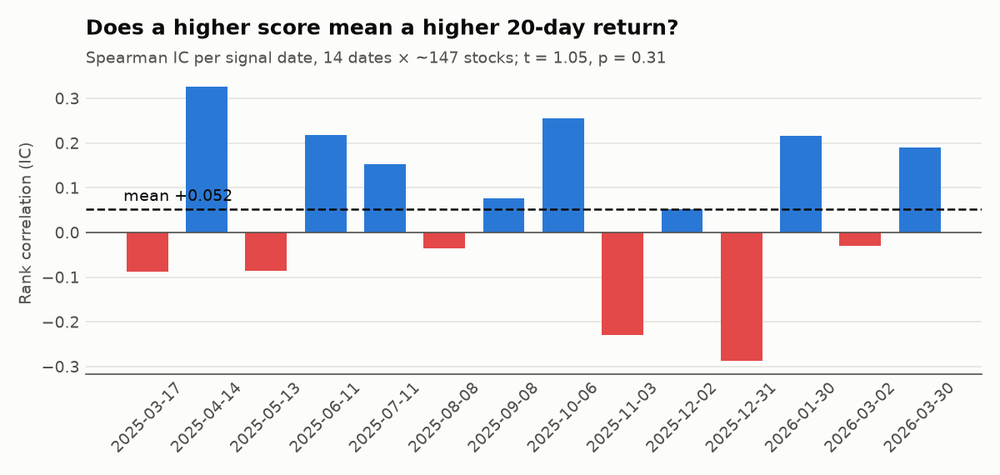
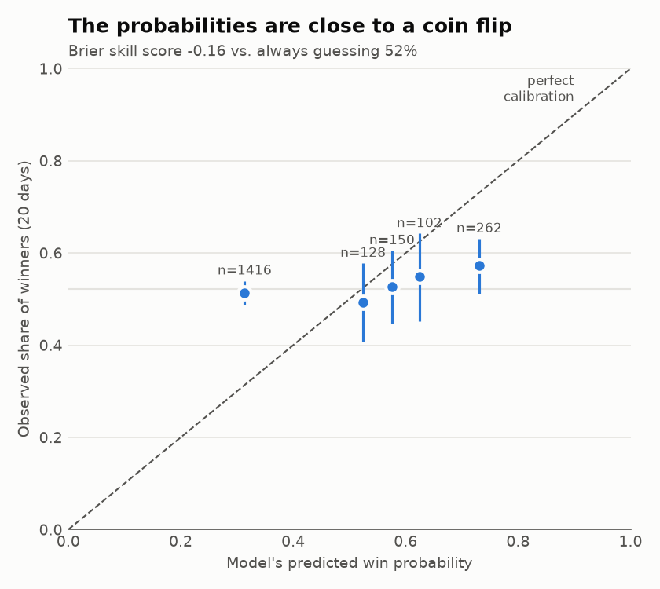

# Signal or Noise? A statistical post-mortem of a stock model

*Forward test: 2026-07-09 → 2026-09-24 · Backtest: 2025-03 → 2026-04 · Every number below is reproduced by `python research/forward_test.py`.*

## Summary

I built a multi-factor model that scores 150 US stocks every day. In a walk-forward backtest, its top picks returned **+99 %** against **+37 %** for QQQ. I then froze the rules and let the model trade a $1,000 paper portfolio in real time. After 51 trading days it was down **−24.7 %**. Over the same days QQQ was up **+2.6 %** and an equal-weight portfolio of the model's own 149 stocks was up **+3.8 %**.

This report tries to explain the gap. I used five statistical checks:

| # | Question | Answer |
|---|---|---|
| 1 | Is the forward loss real, or just noise? | Real. The 95 % bootstrap CI for daily excess return is [−0.89 %, −0.33 %], so it excludes zero. |
| 2 | Could it be bad luck if the backtest were true? | Only about 3 % of simulated windows are this bad. Possible, but unlikely. |
| 3 | Did the live system run the strategy that was backtested? | No. The backtest held picks for 20 trading days; the live system's median hold was **3 days**. |
| 4 | Does the score rank stocks at all? | Weakly at best. Mean IC is +0.05 to +0.07 (all p > 0.1). A top-5 edge shows up for 1 of 3 scoring variants, and it fails a multiple-testing correction. |
| 5 | Are the model's win probabilities honest? | No. The Brier skill score is **−0.16 to −0.28**, which is worse than always guessing the base rate. |

The backtest's sample sizes were also inflated: every outcome was counted three times.

**Conclusion.** I found no evidence that the model has skill. The backtest looks the way an overfit model's backtest usually looks. The forward test failed for a specific reason that I can fix: the live system traded a different strategy from the one that was tested.

---

## 1. The forward test



The paper portfolio started at $1,000 on 2026-07-09 under **policy v2**. The rules were then frozen: no changes to scores, thresholds or the universe, so that the result can be attributed to a single policy (see [`docs/POLICY_LOG.md`](../docs/POLICY_LOG.md)). Fills include a 10 bps spread.

| | Return | Max drawdown |
|---|---|---|
| Model paper portfolio | −24.7 % | −29.3 % |
| QQQ | +2.6 % | |
| Model's own universe, equal weight (149 stocks) | +3.8 % | |

**Comparing against the universe separates the causes.** The stocks the model could choose from went *up* on average. So the loss did not come from being in the wrong part of the market. It came from **which stocks were picked and how they were traded**.

**Is the loss statistically real?** Daily returns are autocorrelated (volatile days cluster together). An ordinary i.i.d. bootstrap would therefore understate the uncertainty. I used a **stationary block bootstrap** (Politis & Romano, 1994) with a mean block length of 5 days and 10,000 resamples. The mean daily excess return is −0.60 %, with a 95 % CI of [−0.89 %, −0.33 %], so zero is not a plausible value.

## 2. Bad luck, or a bad backtest?



Suppose the backtest described the model's true behaviour. How often would a 51-day window be this bad? To find out, I re-sampled 51-day windows from the backtest's own daily returns (block bootstrap, same blocks for the model and QQQ) and compared each window with the actual result.

- Median simulated excess return vs QQQ: **+6.8 %**
- 5th percentile: −22.5 %
- Forward test: **−26.6 %**, as bad as or worse than **2.8 %** of simulated windows

At the usual 5 % level I would reject "the backtest is right". The histogram also shows something important: even the backtest was extremely volatile. It concentrated on five high-beta names, so windows of −20 % were built into it. A strategy with a +99 % backtest and this much variance is weak evidence of anything.

## 3. The live system was not the backtested system



The walk-forward backtest measures each pick's **20-trading-day** forward return. The paper engine, however, rebalances every day into whatever currently passes the gates. When a stock drops off the list, it is sold.

| | Backtest assumption | Live paper portfolio |
|---|---|---|
| Holding period | 20 trading days | median **3 calendar days** |
| Orders in 11 weeks | ≈ 3 rebalances | **115** (49 closed round trips) |
| Turnover | — | **15.5×** capital |
| Transaction costs | — | 2.3 % of capital |

This is an **implementation mismatch**. The backtest validated one strategy and a different one went live. Breakout entries held for 1–3 days are plausibly more exposed to short-term reversals, which a 20-day hold would smooth over. Fixing this doesn't make the model good. It just means the next forward test would be testing what was actually validated.

## 4. Does the score rank stocks?



**First, the unit of observation.** Stocks on the same date share the same market move, so they are not independent. The honest unit is **one cross-section (date)**. There are only 14 of them.

The backtest scores every stock three ways, with a *short*, *medium* and *long* horizon profile, and all three are judged against the same 20-day return. I test each profile separately and report all three. The headline is *short*, because its 20-day time stop matches the 20-day outcome. Reporting only the best variant would be cherry-picking.

| Test (backtest, 14 dates) | short | medium | long |
|---|---|---|---|
| Mean Spearman IC, score vs 20-day return | +0.052 (p = 0.31) | +0.069 (p = 0.13) | +0.064 (p = 0.21) |
| Top-5 picks minus universe average, 20 days | **+6.2 % (t = 2.77, p = 0.016)** | −0.4 % (p = 0.82) | −2.0 % (p = 0.44) |
| Brier skill score of win probabilities | −0.16 | −0.27 | −0.28 |

For the universe as a whole, the average 20-day return was −0.7 % below QQQ (t = −1.09). So the backtest's large excess return came from the five concentrated picks, not from the universe.

Across the full cross-section, every profile ranks stocks only slightly better than chance. The short profile's top-5 edge looks significant on its own (it beat the universe on 12 of 14 dates; sign test p = 0.006). **But it is the best of many attempts:**

- **Forking paths inside this very table.** Three profiles were tested and only one shows an edge. The other two picked *worse* than average with the same data. A real effect would not disappear when the horizon profile changes.
- **Multiple testing.** During development I saved 36 walk-forward runs. Many were code smoke tests rather than distinct strategies, so the true number of "looks" is somewhere between 1 and 36 (times 3 profiles). A Bonferroni correction at α = 0.05 with 13 degrees of freedom requires |t| > 2.16 for one look, > 3.37 for 10 looks and > 4.05 for 36 looks. The top-5 result (t = 2.77) passes only if I pretend I looked once.
- **Not out-of-sample for design.** Walk-forward calibration keeps *thresholds* out-of-sample. The *score weights*, however, were designed in mid-2026 by someone (me) who had already watched these stocks move through 2025. That is look-ahead through the researcher, not through the code.

The forward test then gave the top picks a real out-of-sample trial, and they lost.

## 5. Are the probabilities honest?



The model attaches a "calibrated win probability" to every signal. If those numbers were honest, the points would sit on the diagonal. Instead, for the short profile they sit on a nearly flat line:

| Model says | Stocks that actually rose over 20 days | n |
|---|---|---|
| 31 % (bin ≤ 50 %) | 51 % | 1,416 |
| 52 % | 49 % | 128 |
| 58 % | 53 % | 150 |
| 62 % | 55 % | 102 |
| 73 % | 57 % | 262 |

- **Brier score (short profile):** 0.289, against 0.250 for always predicting the base rate of 52 %. The **Brier skill score is −0.16** (medium −0.27, long −0.28), so the probabilities are *worse than no model*.
- The ordering is roughly right: higher predictions do rise slightly more often. The scale, however, is wildly overconfident at both ends.
- The Wilson intervals in the plot treat stocks as independent. Because stocks on the same date are correlated, the true intervals are wider. The conclusion only gets stronger.

## 6. Sample-size hygiene

**Counting the same outcome three times.** The backtest stores three rows for each (date, stock), one per horizon profile. The rows have different scores but *identical* forward returns. The summary tables pooled all three and reported **6,219** signals. There are really **2,058** distinct outcomes, spread over just **14** independent dates. Sample counts that pool the profiles overstate the evidence by up to 3×. The deeper problem is that 147 stocks on the same day are not 147 independent observations, so the effective sample is closer to 14 than to 2,058. This is a classic **pseudo-replication** error: repeated or clustered measurements were treated as independent.

**Survivorship bias.** The universe was chosen in 2026, from stocks that were well known in 2026. None of the backtest rows carry point-in-time index membership (`point_in_time_universe_member` is false everywhere). This bias is measurable in the data: one universe stock (CFLT) stopped trading *during* the forward window. A backtest built from today's list can never include a failure like that. `historical_universe.py` implements the fix, but it still needs real historical constituent data.

## What I would do differently (and what comes next)

1. **Make the live system run what was tested:** hold each pick for 20 trading days and rebalance on the same schedule as the backtest.
2. **Pre-register v3.** Before it starts, write down in `docs/POLICY_LOG.md` the rules, the benchmark, the test (block-bootstrap excess return vs QQQ) and the sample size needed to detect a realistic edge. Then do not look at the result until the pre-registered date.
3. **Count samples correctly:** count each outcome once and use dates, not rows, as the unit in every gate.
4. **Recalibrate probabilities**, e.g. with isotonic regression fitted on past dates only, and report the Brier skill score out-of-sample.
5. **Track the number of trials.** Log every configuration tried, so that the multiple-testing correction uses a real count instead of a guess.

## Reproducing

```bash
pip install -e ".[research]"
python research/forward_test.py          # uses results/data/ only
```

`results/data/` was exported from the running pipeline with `scripts/export_results.py`. It contains research columns only: model signals, paper orders, the equity curve and public prices. The statistical routines live in [`src/stock_selector/stats_tests.py`](../src/stock_selector/stats_tests.py) and have unit tests in `tests/test_stats_tests.py`.

### References

- Politis, D. N. & Romano, J. P. (1994). The stationary bootstrap. *JASA* 89(428).
- Brier, G. W. (1950). Verification of forecasts expressed in terms of probability. *Monthly Weather Review* 78(1).
- Bailey, D. H. & López de Prado, M. (2014). The deflated Sharpe ratio: correcting for selection bias, backtest overfitting and non-normality. *Journal of Portfolio Management* 40(5).
- Hurlbert, S. H. (1984). Pseudoreplication and the design of ecological field experiments. *Ecological Monographs* 54(2).
