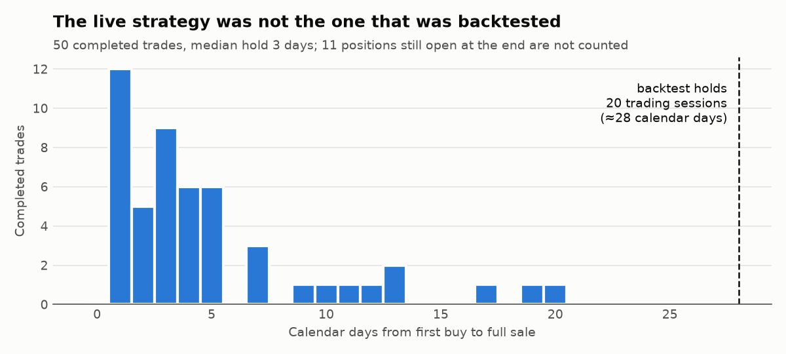
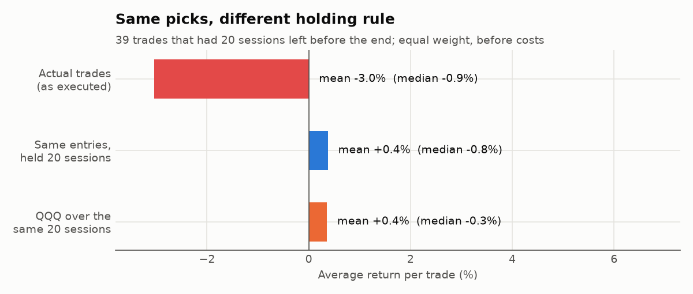
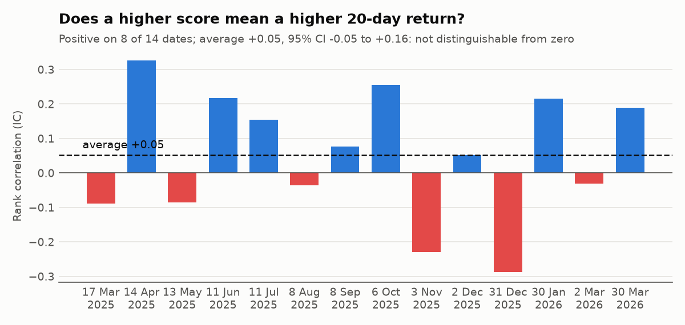

# Signal or Noise? A Forward Test and Statistical Post-Mortem of a Multi-Factor Stock Model

*miemielove520 · Data through the 2026-09-25 close · Every number is read from [`results/summary.json`](summary.json), which `python research/forward_test.py` regenerates byte for byte from [`results/data/`](data/).*

## Abstract

I built a rules-based model that scores about 150 US stocks every day. In a walk-forward backtest (Mar 2025 – Apr 2026; 14 signal dates roughly 20 sessions apart), a portfolio of its five top-scored stocks returned **+99 %**, against **+37 %** for QQQ, after a 10 bps-per-turnover cost charge. I then froze the rules and ran a $1,000 paper portfolio in real time for **55 trading sessions** (9 Jul – 25 Sep 2026). It returned **−24.3 %** after modelled costs, against **+3.0 %** for QQQ and **+3.5 %** for an equal-weight portfolio of its own stock list. The mean excess return versus QQQ per daily mark was −0.60 % (stationary-bootstrap 95 % CI −0.90 % to −0.31 %). If the backtest described the model's true behaviour, a 55-session result this poor would occur about 3 % of the time (one-sided). Re-examining the backtest, I find no detectable ranking skill (mean rank IC +0.05, 95 % CI −0.05 to +0.16, from only 14 dates). A top-5 edge appears in one of three scoring variants, and it survives a multiple-testing correction only under the most generous count of how many things I tried. The model's stated win probabilities are less accurate than a constant base-rate forecast (Brier skill −0.16; date-clustered 95 % CI −0.33 to −0.08), and the backtest's sample sizes were inflated threefold by duplicate rows. The live engine also traded a different rule from the one that was backtested (median hold 3 days instead of 20 sessions), so overfitting and implementation mismatch cannot be separated with these data. Apart from the forward return itself, every analysis here was chosen after the result was known and should be read as diagnostic.

**In plain language**

| Question | Answer |
|---|---|
| Is the loss just day-to-day noise? | No. It is too large and too consistent for that. |
| If the backtest were right, how often would 11 weeks look this bad? | About 3 % of the time. |
| Did the live system trade what was tested? | No. It held stocks for about 3 days; the backtest held them for 20 sessions. |
| Does a higher score predict a higher return? | Not detectably. With 14 dates, the data cannot tell the score apart from no skill. |
| Are the model's "win probabilities" honest? | No. When it said 73 %, 57 % of those stocks rose. That is worse than always guessing 52 %. |
| How much evidence did the backtest really have? | 6,219 "signals" turn out to be 2,073 distinct outcomes on 14 dates, worth roughly 67 independent observations. |

---

## 1. Data and study design


**Model.** Every day the model scores each stock on trend, momentum, relative strength, fundamentals, valuation, analyst and news sentiment, and event risk. It does this under three horizon profiles (*short*, *medium*, *long*) and passes candidates through a set of strict quality gates.

**Backtest.** The walk-forward backtest replays 14 signal dates from 2025-03-17 to 2026-03-30, spaced about 20 sessions apart so that the 20-session outcomes do not overlap. On each date, the model sees prices up to that date only. Cross-sections contain 147 stocks per date. The headline backtest portfolio holds the five highest-scored stocks for 20 sessions and is charged 10 bps per unit of turnover.

The backtest produced four portfolio variants, and **all four beat QQQ**:

| Variant | Period | Return | QQQ |
|---|---|---|---|
| Top-5 by high-probability score (headline) | 2025-03-17 → 2026-04-28 | +99 % | +37 % |
| Top-5 by calibrated probability | 2025-03-17 → 2026-04-28 | +91 % | +37 % |
| Watchlist or better | 2025-05-13 → 2026-04-28 | +66 % | +28 % |
| Strict high-probability only | 2025-08-08 → 2025-10-06 | +14 % | +6 % |

The headline variant is the one whose rules are closest to the live paper portfolio.

**Design timeline.** The score weights were designed between late May and early July 2026. By then the whole backtest period had already happened, so the backtest is in-sample with respect to the score design, even though thresholds are calibrated walk-forward.

**Forward test.** Policy v2 was frozen on 2026-07-09 ([`docs/POLICY_LOG.md`](../docs/POLICY_LOG.md)). An automated pipeline then rebalanced a $1,000 paper portfolio on trading days, normally after the close. Fills were the close ± 10 bps plus about 5 bps of slippage, so each order cost about 15 bps on average. Bug and operations fixes were allowed during the freeze and were logged; strategy changes were not.

The test ran for 55 trading sessions, from the 2026-07-09 close to the 2026-09-25 close. It produced 52 portfolio marks, that is, 51 mark-to-mark intervals:

- 3 runs used an earlier close than their run date: two executed before the open, and one ran on Labor Day, when the market was closed. The Labor Day mark was merged with the 2026-09-04 mark it duplicated.
- 4 intervals between marks span more than one session, because a run failed.

The analysis aligns every mark on the close it actually used (`paper_tracker.price_dates_for_runs`). The scheduled runs on 2026-09-28, 09-29 and 09-30 failed because the host machine slept mid-run, and the experiment was closed at that point. The end date was therefore set by the infrastructure, not by the results.

**Benchmarks and definitions.**

- **QQQ** is the main benchmark.
- **Model's own stock list.** An equal-weight, buy-and-hold portfolio of the 149 listed stocks that had prices throughout. This tells us whether the loss came from the market segment the model was choosing from. One listed ticker, CFLT, has no price data in either period and is excluded from both.
- **Excess return** is defined two ways:
  - *Per mark:* the model's return minus QQQ's return over each of the 51 mark-to-mark intervals (QQQ is measured over the same interval).
  - *Cumulative:* (1 + R_model) / (1 + R_QQQ) − 1 = −26.5 %. This is why it differs from the simple difference −24.3 − 3.0 = −27.3 points.

**Pre-specified vs post-hoc.** Only one evaluation was specified before the test: a check after 20 sessions comparing the paper portfolio with the benchmark and with the backtest's expectation (POLICY_LOG, v2). At that point (the 2026-08-06 close) the portfolio was at **−15.7 %** against **−1.2 %** for QQQ. The test was not stopped there and continued until the automated runs failed. Every other analysis in this report was chosen after the result was known.

## 2. Methods

| Question | Statistic | Unit, n | Null | Notes |
|---|---|---|---|---|
| Forward underperformance | Mean excess return per mark; stationary bootstrap CI (Politis & Romano, 1994) | Interval, 51 | Mean excess = 0 | Geometric blocks, mean length 5; sensitivity 1–20; i.i.d. and Newey–West (1987) t as checks |
| Backtest-implied predictive check | Share of 55-session windows, re-sampled from the backtest's daily returns, that are as bad as the live result | Window, 10,000 | Forward returns follow the backtest's return process | One-sided Monte Carlo tail probability |
| Implementation | Holding periods, turnover, counterfactual 20-session hold of the same entries | Trade, 50 / 39 | — | Audit, not a test |
| Ranking skill | Spearman rank IC per date; top-5 minus universe 20-session return; t-test, sign test, Wilcoxon | Date, 14 | Mean = 0 | Bonferroni thresholds for 1–36 looks |
| Calibration | Brier skill score; Murphy (1973) decomposition; reliability with Wilson (1927) and date-cluster bootstrap intervals | Stock-date, 2,058 (14 clusters) | Skill = 0 | Raw backtest probabilities |
| Sample size | Duplication factor; intraclass correlation; Kish (1965) design effect | Stock-date | — | — |

Implementations are in [`src/stock_selector/stats_tests.py`](../src/stock_selector/stats_tests.py), with unit tests in `tests/test_stats_tests.py`.

## 3. Results

### 3.1 The forward test lost, and not by noise


| Forward test, 2026-07-09 → 2026-09-25 close | Value |
|---|---|
| Model paper portfolio ($1,000 → $757.26) | **−24.3 %** |
| QQQ | +3.0 % |
| Model's own stock list, equal weight (149 stocks) | +3.5 % |
| Cumulative excess vs QQQ | −26.5 % |
| Maximum drawdown | −29.3 % |
| At the pre-specified 20-session check (2026-08-06) | −15.7 % (QQQ −1.2 %) |

**The stock list rose, so where the model was choosing from was not the problem.** The loss came from which stocks were picked and how they were traded.

**Market exposure does not explain it either.** Regressing the model's per-mark returns on QQQ's gives β = 0.92 (R² = 0.48) and an intercept of −0.59 % per mark. Market exposure alone would have predicted a small gain.

**The loss is too large to be day-to-day noise.**

- The mean excess return per mark was −0.60 % (SD 1.22 %).
- Its stationary-bootstrap 95 % CI is **[−0.90 %, −0.31 %]**, which excludes zero.

Excess returns may be serially dependent, because positions are held across days and volatility clusters, so I used a block bootstrap as a precaution. The measured lag-1 autocorrelation is small (−0.09), and the result does not depend on the block length:

| Mean block length (marks) | 1 | 2 | 5 | 10 | 20 |
|---|---|---|---|---|---|
| 95 % CI of mean excess per mark | −0.93 % to −0.27 % | −0.93 % to −0.27 % | −0.90 % to −0.31 % | −0.84 % to −0.36 % | −0.79 % to −0.41 % |

The i.i.d. t-statistic is −3.50 (p = 0.001), and the Newey–West t-statistic with 5 lags is −3.54.

### 3.2 If the backtest were right, this would be rare


I re-sampled 55-session periods from the backtest's own daily returns, using the same blocks for the model and for QQQ, and compared each with the live result.

- Median simulated excess vs QQQ: **+7.4 %**
- 5th percentile: −23.4 %
- Live result: **−26.5 %**

**About 3 % of simulated periods (3.05 %) are this bad or worse.** This is a one-sided Monte Carlo tail probability, with a Monte Carlo standard error of 0.17 percentage points. It stays between 2.9 % and 3.1 % for mean block lengths from 1 to 20 days.

Two features make this check conservative:

- The backtest portfolio was more than twice as volatile as the live one (daily excess SD 2.8 % vs 1.2 %).
- It is the null of a composite hypothesis: same strategy, same market regime, same cost model, no overfitting. Rejecting it is consistent with any of those failing, so it does not identify the cause.

The backtest was also weak evidence to begin with. Its mean daily excess return over 281 sessions was +0.17 % with an SD of 2.84 %, a t-statistic of **1.01 (p = 0.31)**. Taken at face value, +99 % vs +37 % is not statistically distinguishable from zero excess return, even before any correction for overfitting.

### 3.3 The live system did not trade the backtested rule



The backtest measures each pick's **20-session** forward return. The paper engine instead rebalanced daily into whatever passed the gates that day, and sold a stock as soon as it dropped off the list.

| | Backtest | Live paper portfolio |
|---|---|---|
| Holding period | 20 trading sessions | median **3 calendar days** (50 completed trades; 11 positions still open at the end are not counted, which biases the median down slightly) |
| Orders over the test | about 3 rebalances | **118** |
| Turnover | — | **15.7×** capital |
| Trading costs | 10 bps per unit of turnover | 2.35 % of capital (≈ 15 bps per order) |

**Counterfactual: the same entries, held for 20 sessions.** For the 39 completed trades that still had 20 sessions left before the end, I compared three things over the same 20 sessions. All averages are equal-weighted and before costs.

| | Mean | Median |
|---|---|---|
| Actual trades, as executed | **−3.0 %** | −0.9 % |
| Same entries, held 20 sessions | +0.4 % | −0.8 % |
| QQQ | +0.4 % | −0.3 % |



Two comparisons come out of this table:

- **Holding for 20 sessions would have done better on average:** +3.4 points, but the 95 % CI is −0.9 to +7.7 (p = 0.12).
- **Held for 20 sessions, the picks behaved roughly like QQQ:** mean difference +0.0 points, 95 % CI −4.0 to +4.1.

So the evidence suggests that the short holding period caused much of the loss, and that the picks themselves had no detectable edge. Neither comparison is conclusive with 39 trades.

**Other ways the live run differed from the written policy.** A post-hoc audit found these (all logged in [`docs/POLICY_LOG.md`](../docs/POLICY_LOG.md)):

1. A probability-calibration table was active for the whole test through a fallback file lookup, although the policy notes say it was off. That table was fitted on the same backtest rows analysed in §3.5.
2. Market-regime protection was off for the whole test, because the only file path the paper engine reads did not exist.
3. A rebalance ran on Labor Day (market closed) at the previous Friday's prices.
4. Two runs executed before the open used the previous close. The analysis corrects for this (§1).

Items 1 and 2 mean the live system differed from the documented one in two more ways that could affect returns. Their direction cannot be estimated from these data.

### 3.4 The score does not detectably rank stocks



**The unit of analysis.** Stocks on the same date share the same market move, so the unit is the **date**, and there are 14 of them. The IC is the Spearman rank correlation between the score and the following 20-session return, across stocks on one date, averaged over dates (Grinold & Kahn, 2000).

The backtest scores every stock under three horizon profiles. I report all three, rather than only the one that looks best:

| 14 dates | short (headline) | medium | long |
|---|---|---|---|
| Mean rank IC (95 % CI) | +0.052 (−0.055 to +0.159), p = 0.31 | +0.069, p = 0.13 | +0.064, p = 0.21 |
| Top-5 minus stock list, per 20 sessions (95 % CI) | **+6.2 %** (+1.4 % to +11.0 %), p = 0.016 | −0.4 %, p = 0.82 | −2.0 %, p = 0.44 |

The stock list as a whole returned 0.7 points less than QQQ per 20 sessions (t = −1.09, p = 0.30). The backtest's large excess return therefore came from the five concentrated picks, not from the list.

**Ranking (IC).** The data cannot tell the score apart from no skill. The interval includes zero, but it also includes ICs that practitioners would consider useful. The problem is power, not proof of absence: detecting a true IC of 0.05 with 80 % power at α = 0.05 would need about **109** non-overlapping 20-session dates, roughly 9 years of data. An IC of 0.03 would need 301 dates.

**The top-5 edge (short profile only)** beat the list on 12 of 14 dates (two-sided sign test p = 0.013; Wilcoxon p = 0.017). It is fragile for three reasons:

**One of three.** The three profiles share inputs and outcomes, so a robust edge would be expected to show up, at least weakly, in more than one. The other two have negative point estimates. That pattern is what selecting on noise looks like (Gelman & Loken, 2014), though it does not prove it.

**Multiple testing.** Bonferroni |t| thresholds with 13 degrees of freedom:

| Looks | 1 | 3 | 4 | 10 | 36 |
|---|---|---|---|---|---|
| Threshold | 2.16 | 2.75 | 2.90 | 3.37 | 4.05 |

Corrected only for the three profiles in this table, the result survives by a hair (t = 2.77; p = 0.016 against 0.05 / 3 = 0.017). It does not survive four or more looks, and during development I saved 36 walk-forward runs. Because those runs overlap heavily, Bonferroni over-corrects. The honest summary is that the edge is significant only under the most generous count of how many things I tried. Harvey, Liu & Zhu (2016) argue that new return predictors should clear |t| > 3. A selection-bias-corrected Sharpe ratio (Bailey & López de Prado, 2014) would be a stricter version of this check.

**Not out-of-sample for design.** The score weights were designed after the backtest period had happened (§1). The forward test was meant to be the real out-of-sample trial, but because of §3.3 it did not test the top-5 / 20-session rule directly.

### 3.5 The stated probabilities are miscalibrated


The model attaches a "calibrated win probability" to every signal. That is the model's own label, not a statistical property. These are the raw backtest values; the live engine additionally applied an adjustment table fitted on these same rows (§3.3).

| Model says (bin) | Stocks that rose within 20 sessions | 95 % CI, resampling whole dates | n |
|---|---|---|---|
| 31 % (≤ 50 %) | 51 % | 40 % – 62 % | 1,416 |
| 52 % (50–55 %) | 49 % | 37 % – 61 % | 128 |
| 58 % (55–60 %) | 53 % | 40 % – 64 % | 150 |
| 62 % (60–65 %) | 55 % | 41 % – 68 % | 102 |
| 73 % (> 65 %) | 57 % | 45 % – 69 % | 262 |

- **Brier score (Brier, 1950):** 0.289, against 0.250 for always predicting the base rate of 52 %. The **Brier skill score is −0.16**, so the probabilities are worse than no model. It is −0.27 for the medium profile and −0.28 for the long one.
- **Murphy decomposition:** reliability (miscalibration) 0.031, resolution 0.0005, uncertainty 0.250. Almost all of the penalty is miscalibration, and resolution is near zero, so the forecasts barely separate future winners from losers.
- **Calibration-in-the-large:** the mean forecast was 41.5 % against 52.2 % observed. The model was too pessimistic on average, and 69 % of forecasts fall in the lowest bin.
- **Clustering.** Wilson intervals (Wilson, 1927) assume independent stocks, but stocks on the same date move together. I therefore resampled whole dates. The intervals widen two- to fourfold, yet the two extreme bins still exclude their forecasts, the Brier skill score stays negative in every resample (95 % CI −0.33 to −0.08), and it is negative on 13 of the 14 dates taken one at a time. The conclusion survives clustering because the miscalibration is large, not because clustering helps it.

### 3.6 Sample-size audit

**Each outcome was counted three times.** The backtest stores one row per (date, stock, horizon profile). The three rows have different scores but identical outcomes:

- 6,219 rows = 3 profiles × **2,073** distinct (date, stock) outcomes.
- 2,058 remain after dropping 15 stray single-stock rows.

The summary tables and the minimum-sample gate pooled all three profiles. Treating triplicates as independent inflates n threefold and understates standard errors by about √3. This is a classic pseudo-replication error (Hurlbert, 1984).

**Stocks on the same date are not independent either.** The intraclass correlation of 20-session returns within a date is 0.20 (0.17 for the up/down indicator). With 147 stocks per date, the design effect is 1 + (147 − 1) × 0.20 ≈ **31** (Kish, 1965). The 2,058 outcomes therefore carry roughly the information of **67 independent observations**. For date-level statistics such as the IC and the top-5 spread, the unit is the date (n = 14). Petersen (2009) discusses the same issue for finance panel data.

## 4. Discussion

**Findings, in order of strength:**

1. The forward test lost money relative to QQQ by a margin that is not plausibly noise.
2. The model's probabilities are miscalibrated.
3. The backtest's evidence was much thinner than it looked: duplicated rows, clustered outcomes, 14 dates, and a top-5 result that is fragile under multiple testing.
4. The live engine did not run the backtested rule.

**What cannot be determined.** These data cannot separate the remaining explanations for the forward result:

- The backtest overstated the model (overfitting, plus researcher look-ahead in the score design).
- The implementation mismatch.
- The undocumented configuration differences in §3.3.
- A different market regime.

The counterfactual in §3.3 points towards the holding rule, but it is not conclusive.

**Power.** The forward test's excess returns had an SD of about 1.2 % per mark.

- Detecting an effect as large as the one observed (−0.60 % per mark) needs about **33** observations, so 51 was enough to detect a failure of this size.
- Confirming a modest positive edge of +0.05 % per day (about 13 % a year) would need about **4,653** observations, roughly **18 years**.

A forward test of this length can expose a disaster, but it cannot confirm skill.

## 5. Threats to validity

- **Internal.**
  - The implementation mismatch (§3.3).
  - The undocumented calibration table and the disabled regime protection.
  - Researcher look-ahead in the score weights.
  - Bug fixes made during the freeze (logged; none changed the strategy rules).
- **Construct.**
  - "Calibrated win probability" is a label, not a calibrated quantity.
  - Two definitions of excess return are used (per mark and cumulative); both are stated.
- **External.**
  - One 11-week period in one market regime.
  - 150 stocks chosen by hand in 2026.
  - **Survivorship bias.** No backtest row carries point-in-time index membership, so companies that failed or were delisted during 2025–26, before the list was made, are missing. This flatters the backtest by an amount that these data cannot estimate. `historical_universe.py` implements the fix but needs real constituent history.
- **Statistical conclusion.**
  - n = 14 dates for the backtest tests.
  - Multiple testing.
  - Tests chosen after seeing the result.

## 6. What I would do differently

1. **Make the live system run what was tested:** hold each pick for 20 sessions and rebalance on the backtest's schedule.
2. **Pre-register the next version.** Write the following into `docs/POLICY_LOG.md` before the test starts, and do not look before that date:
   - the rules, the benchmark and the cost model;
   - the primary endpoint and its test;
   - the analysis date.

   Given the power calculation above, the realistic goal of a short forward test is a pre-specified *failure* criterion, not a confirmation of skill.
3. **Count samples correctly:** count each outcome once, and use dates, not rows, as the unit in every gate.
4. **Recalibrate probabilities out of sample,** for example with isotonic regression fitted on past dates only, and report the Brier skill score on later dates.
5. **Track the number of trials.** Log every configuration that is tried, so that a multiple-testing correction uses a real count instead of a guess.
6. **Check that the configuration that actually runs matches the documented one** at the start of the test, not after it.

## Reproducing

```bash
pip install -e ".[research]"
python research/forward_test.py              # rewrites summary.json and figures/ from data/
git diff --exit-code results/summary.json    # CI runs this and fails if any number changes
python scripts/build_report_pdf.py           # typesets this report as results/REPORT.pdf
```

`results/data/` was exported from the running pipeline with `scripts/export_results.py`. It contains research columns only: model signals, paper valuations and orders, and public market prices. See [`results/README.md`](README.md) for a data dictionary.

## References

- Bailey, D. H., & López de Prado, M. (2014). The deflated Sharpe ratio: Correcting for selection bias, backtest overfitting and non-normality. *Journal of Portfolio Management*, 40(5), 94–107.
- Brier, G. W. (1950). Verification of forecasts expressed in terms of probability. *Monthly Weather Review*, 78(1), 1–3.
- Gelman, A., & Loken, E. (2014). The statistical crisis in science. *American Scientist*, 102(6), 460–465.
- Grinold, R. C., & Kahn, R. N. (2000). *Active Portfolio Management* (2nd ed.). McGraw-Hill.
- Harvey, C. R., Liu, Y., & Zhu, H. (2016). … and the cross-section of expected returns. *Review of Financial Studies*, 29(1), 5–68.
- Hurlbert, S. H. (1984). Pseudoreplication and the design of ecological field experiments. *Ecological Monographs*, 54(2), 187–211.
- Kish, L. (1965). *Survey Sampling*. Wiley.
- Murphy, A. H. (1973). A new vector partition of the probability score. *Journal of Applied Meteorology*, 12(4), 595–600.
- Newey, W. K., & West, K. D. (1987). A simple, positive semi-definite, heteroskedasticity and autocorrelation consistent covariance matrix. *Econometrica*, 55(3), 703–708.
- Petersen, M. A. (2009). Estimating standard errors in finance panel data sets: Comparing approaches. *Review of Financial Studies*, 22(1), 435–480.
- Politis, D. N., & Romano, J. P. (1994). The stationary bootstrap. *Journal of the American Statistical Association*, 89(428), 1303–1313.
- Wilson, E. B. (1927). Probable inference, the law of succession, and statistical inference. *Journal of the American Statistical Association*, 22(158), 209–212.
